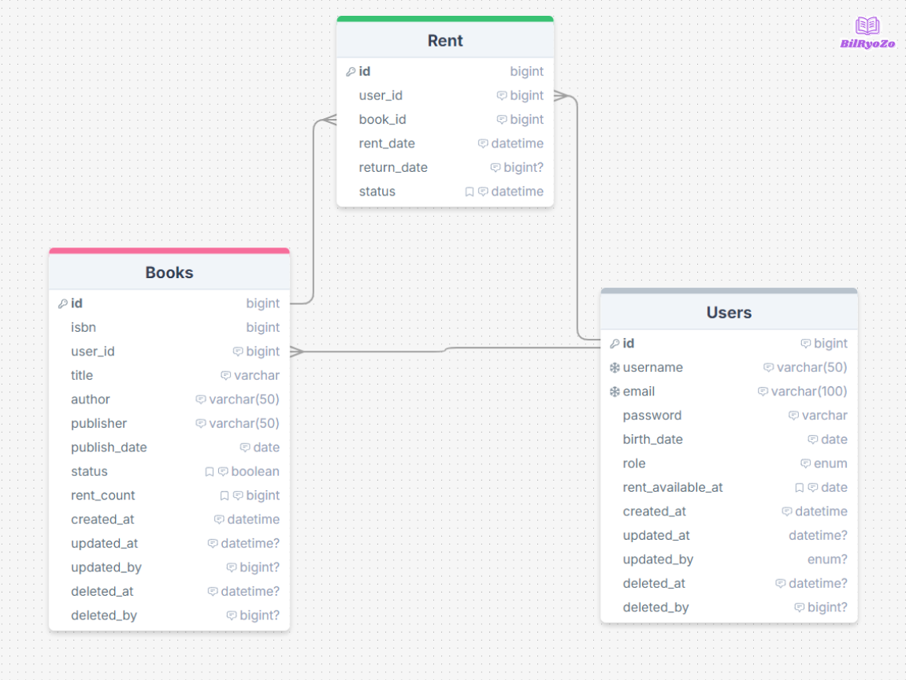

<!--
# 📚 Chaek-BilRyozo

## 도서 대여 관리 시스템
도서 대여, 반납을 관리해주는 프로그램입니다.  

## ⚒️ 주요 기능

    
<h3>사용자</h3>

    <ul>   
        <b><li>회원가입</li></b>
        <ul>
             <li>아이디, 이메일, 비밀번호, 생년월일을 입력하여 계정 생성</li>
        </ul>
    </ul>
    <ul>
        <b><li>로그인</li></b>
        <ul>
             <li>Spring Security 기반 로그인</li>
            <li>로그인 시 access token, refresh token 발급</li>
            <li>redis에 refresh token 저장</li>
        </ul>
    </ul>
    <ul>
        <b><li>로그아웃</li></b>
        <ul>
             <li>로그아웃 시 발급된 token 무효화</li>
        </ul>
    </ul>

    
<h3>도서</h3>

    <ul>
        <b><li>도서 등록</li></b>
        <ul>
             <li>isbn, 도서명, 작가, 출판사, 출판일을 입력하여 도서 등록</li>
            <li>ADMIN 권한만 도서 등록 가능</li>
        </ul>
    </ul>
    <ul>
        <b><li>도서 단일 조회</li></b>
        <ul>
             <li>도서 id를 입력하여 도서 단일 조회</li>
        </ul>
    </ul>
    <ul>
        <b><li>도서 필터링, 검색 전체 조회</li></b>
        <ul>
             <li>파라미터가 없을 경우 기본값으로 페이징된 전체 데이터 조회</li>
            <li>파라미터로 페이징 정보를 받을 경우 해당 값 기반으로 페이징 된 결과 반환</li>
            <li>파라미터로 type, keyword를 전달 받을 경우 해당 파라미터 기반으로 검색</li>
        </ul>
    </ul>
    <ul>
        <b><li>인기 도서 조회</li></b>
        <ul>
             <li>파라미터로 전달받은 값을 기준으로 대출 횟수가 해당 값보다 큰 데이터 반환</li>
        </ul>
    </ul>
    <ul>
        <b><li>도서 수정</li></b>
        <ul>
             <li>도서 id를 입력하여 해당 도서 수정</li>
            <li>ADMIN 권한만 수정 가능</li>
            <li>수정 시 수정 시각과 수정한 관리자 id를 DB에 저장</li>
        </ul>
    </ul>
    <ul>
        <b><li>도서 삭제</li></b>
        <ul>
             <li>도서 id를 입력하여 해당 도서 삭제</li>
            <li>ADMIN 권한만 수정 가능</li>
            <li>삭제 시 삭제 시각과 삭제한 관리자 id를 DB에 저장</li>
        </ul>
    </ul>

    
<h3>대출</h3>

    <ul>
        <b><li>도서 대출</li></b>
        <ul>
             <li>도서 id를 파라미터로 전달하여 해당 도서 대출</li>
            <li>대출 가능일, 해당 도서 대출 가능 여부를 확인하여 대출</li>
        </ul>
    </ul>
    <ul>
        <b><li>도서 반납</li></b>
        <ul>
             <li>도서 id를 파라미터로 전달하여 해당 도서 반납</li>
            <li>예정 반납일 이후 반납하는 경우 연체 기간만큼 대출 불가</li>
        </ul>
    </ul>

 

## **📝 프로젝트 문서**
|문서|URL|
|---|---|
|ERD|[🔗Link](docs/ERD.png)|
|API 명세서|[🔗Link](https://www.notion.so/API-751fcfb7da3b4d818a9fddc9ee86ff1e?pvs=4)|
|요구사항 정의서|[🔗Link](https://www.notion.so/51fcb03278344a93a4c20ca9651b7472?pvs=4)|
 

## 💬 커밋 컨벤션

* *feat* : 기능 추가
* *fix* : 버그 수정
* *refactor* : 코드 리팩토링
* *docs* : 문서 수정
* *test* : 테스트 코드
* *chore* : 개발 코드 외 기타 변경사항
* *comment* : 주석 추가 및 변경
 

## 📊 ERD

  

## 📊 Git 브랜치 전략

  

-->
